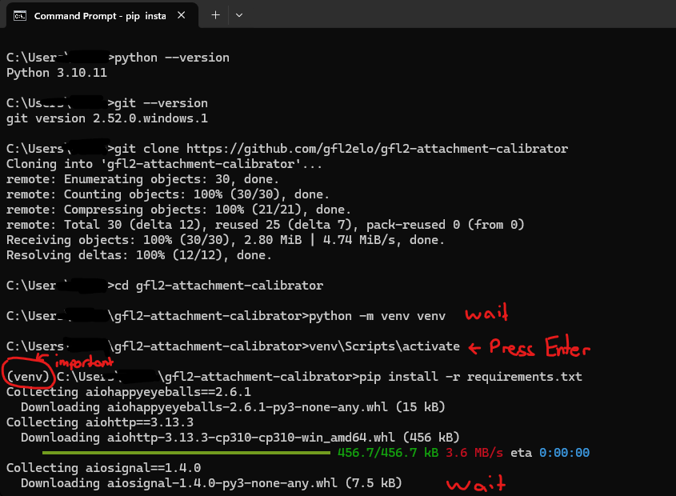
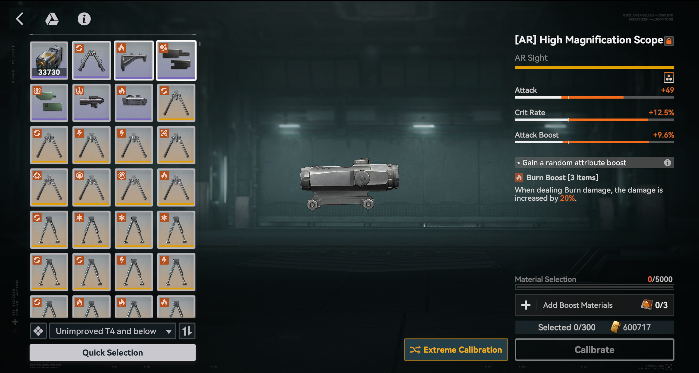
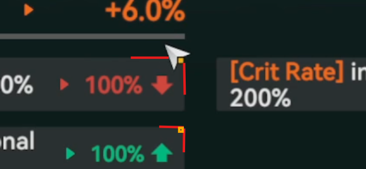
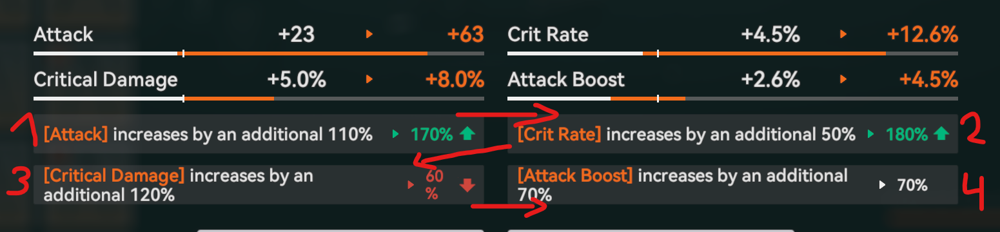

# Attachment Calibrator — Installation Guide

## 0. Compatibility

This script was developed and tested on **Windows only**. It may work on macOS or Linux but this has not been tested and is not supported. The installation steps in this guide are written for Windows.
## 1. Python

Check if Python is installed by opening a terminal and running:
```
python --version
```
If you get a version number (3.10 or higher required), you're good. If not, download and install Python from https://www.python.org/downloads/. During installation, **make sure to check "Add Python to PATH"**.

---

## 2. Git

> **Note:** If you downloaded the project as a ZIP file via the green "code" button top right, and extracted it manually, you can skip this step entirely. Please `cd` into the extracted folder and proceed with step 4.


Check if Git is installed:
```
git --version
```
If not installed, download it from https://git-scm.com/downloads and install with default settings.

---

## 3. Clone the repository

Open a terminal (cmd) in the folder where you want the project to be installed.
If you are unsure how to change folders, you can simply run the command below and the project will install in the current folder.
```
git clone https://github.com/gfl2elo/gfl2-attachment-calibrator
cd gfl2-attachment-calibrator
```

---

## 4. Install Python dependencies
Activate the venv and install the requirements. Your terminal (cmd) window should look something like the picture below by now.
```
python -m venv venv
venv\Scripts\activate
pip install -r requirements.txt
```
> 

---

## 5. Tesseract OCR

### 5.1 Download the installer
Get the Tesseract installer from:
https://github.com/UB-Mannheim/tesseract/wiki

Download the latest Windows installer (e.g. `tesseract-ocr-w64-setup-5.x.x.exe`).

### 5.2 Install and save the path
Run the installer. On the "Choose Install Location" screen, note down the install path — by default it is:
```
C:\Program Files\Tesseract-OCR
```
Complete the installation.

### 5.3 Add Tesseract to PATH
1. Press `Windows + S` and search for **"Environment Variables"**, then click **"Edit the system environment variables"**
2. In the System Properties window, click **"Environment Variables..."**
3. Under **"System variables"**, find and select **"Path"**, then click **"Edit"**
4. Click **"New"** and paste your Tesseract install path, e.g.:
```
C:\Program Files\Tesseract-OCR
```
5. Click OK on all windows to save.

### 5.4 Verify the installation
Open a **new** terminal window and run:
```
tesseract --version
```
You should see a version number. If you get an error, double-check the PATH step above.

---

## 6. Legacy OCR data

For better accuracy with game fonts, you need the legacy `eng.traineddata` file.

1. Go to https://github.com/tesseract-ocr/tessdata
2. Find `eng.traineddata` in the file list and download it (click the file, then "Download raw file")
3. Place it in your Tesseract `tessdata` folder, replacing the existing file:
```
C:\Program Files\Tesseract-OCR\tessdata\eng.traineddata
```

---

You're now ready to use the script. Continue with the usage guide below.

---

---

# Attachment Calibrator — Usage Guide

## Running the scripts

You can run the scripts in two ways:

**Option A (recommended) — IDE:**
Open the project folder in an IDE of your choice (e.g. PyCharm, VS Code) and use the built-in run button to execute the scripts directly.

**Option B — Command line:**
Open a terminal, navigate to the project folder and activate the virtual environment, then run the script:  

Activate the venv:
```
cd path\to\attachment-calibrator
.venv\Scripts\activate
```  
You should now be able to execute any script from the project folder as:
```
python script_name.py
```

## 1. Game settings

Before doing anything else, open the game settings, navigate to **Graphics**, and set the window mode to **Maximize**. Once set, **do not move the game window** — the coordinates are tied to its position on screen.

---

## 2. Navigate to the calibration screen

In-game, navigate to the calibration screen.

> 

---

## 3. Prepare the calibration screen

This step is important. Make sure you are using a **piece that has already been upgraded at least once**. Before proceeding, clear the **"Are you sure you want to restore..."** confirmation popup by checking **"Do not show again today"** and dismissing it. If you skip this, the script will break.

---

## 4. Collect coordinates

The script works by clicking specific positions on your screen, so you need to tell it where things are first.

Run the coordinate collector:
```
python get_coordinates.py
```

Follow the on-screen instructions. A few things to keep in mind:

- For **buttons** (Quick Selection, Calibrate, Confirm, Restore): hovering roughly over the middle of the button is fine.
- For **stat values** (the percentage numbers): precision matters. Align the **yellow box at the bottom of your cursor** to the **top-right corner of the grey stat box**, as shown below.

> 

When asked whether to save 3 or 4 stat coordinates, **4 is recommended** as it allows you to use both modes. You need 4 coordinates if you plan to calibrate muzzles.  

During the coordinate for the stats, please move the cursor in the following order:
> 

The coordinates will be saved to `coordinates.json`. If you weren't confident about your placement, re-run `get_coordinates.py` and redo it — it will overwrite the previous file. If you only need to redo the stat positions, run `update_stat_cords.py` instead.

---

## 5. Run the calibrator

From the calibration main screen, run:
```
python mover.py
```

Follow the on-screen instructions:

1. **Select a mode:**
   - **Mode 1** — regular attachment (3 stats, works with 3 or 4 saved coordinates)
   - **Mode 2** — muzzle (4 stats, requires 4 saved coordinates)

   > **Note:** Mode 2 will not work if you only saved 3 stat coordinates during setup.

2. **Set your goal stat total:** After selecting a mode you will be asked to enter a desired stat total. This is the sum of all stat percentages added together — for example, 200% + 150% + 120% = **470** (enter the number without the % sign). The script will keep rerolling until this total is reached or exceeded.
   - Mode 1 default: **450** (range: 100–600)
   - Mode 2 default: **600** (range: 100–800)

3. **Set a gold limit:** Each calibration attempt costs 20,000 gold. The default limit is **700,000**, and a limit between **600,000 and 800,000** is suggested. The script checks the remaining budget before every attempt and never knowingly starts one that would exceed the limit. If the limit is not divisible by 20,000, it stops at the highest complete attempt below the limit.

4. **Choose whether to lower the goal gradually:** When enabled, the goal drops by **10** after each **250,000 gold spent**, down to a minimum total that you choose. For example, a 460 starting goal with a 430 minimum becomes 450 after 250,000 gold and 440 after 500,000 gold. Because attempts cost 20,000, a change takes effect on the first attempt that crosses each threshold.

Your choices are saved automatically to `settings.json`. On later runs, the script shows all saved details in brackets and asks whether to reload them. Press Enter to accept the saved settings, or answer `n` to enter and save a new configuration.

### Gold usage history

After each successful full attachment run, the script appends the result to `gold_history.json`. Individual calibration attempts and runs that end without an accepted attachment are not recorded as completed runs. Each entry includes the mode, starting goal, final goal after any gradual decreases, achieved total, attempts, and total gold consumed.

The file also maintains separate averages for each mode and goal band. A band covers the 20 points ending at the effective multiple-of-10 goal: for example, goals of 420, 450, and 460 are grouped as **400–420%**, **430–450%**, and **440–460%**. After saving a successful run, the script prints the updated average for its band.

### Valuable partial-read rescans

Every accepted OCR value must be between **10% and 200%** and divisible by **10**. Readings such as 11–19 are rejected instead of being mistaken for 110–190.

If the first OCR pass misses one or more values but successfully reads at least two stats totaling **270% or more**, the script takes four additional screenshots and rescans only the missing values. The retry crop moves a few pixels left, right, upward, and downward across the four scans so a number cut off at one crop position can be recovered at another. Any stat initially read as **10% or 20%** also receives all four verification scans, because a dropped zero could turn a strong 100% or 200% stat into a destructive misread. A **120%** reading is checked twice with shifted crops without adding console noise, because this value can be an artifact of 130%. The script also verifies the final stat four additional times when the preceding stats total at least **250%** but the complete reading would still miss the current goal (or fail the 100%-per-stat requirement). To avoid discarding a good attachment because of repeated low misreads, the highest valid reading from the original scan and all applicable verification scans is used. These rescans do not spend gold.

The script will then count down and start automatically.

### Controls
| Key | Action |
|-----|--------|
| F9  | Pause / Resume |
| F10 | Stop the script |

---

## Important disclaimers

### OCR accuracy
The OCR reading is **not 100% accurate** and will make errors. The script has several built-in correction rules to catch common misreads, but it is not perfect. If you notice a consistent pattern — for example, 70% always being read as 710% — please report it on Discord (**elo_777**) so a correction rule can be added.

### Gold consumption
The configured gold limit is based on the script's attempt count; it cannot read your actual in-game gold balance. Make sure you have at least as much gold available as the limit you enter. If your balance is lower than the configured limit, the script cannot detect that and may continue clicking after the game stops accepting calibrations.

### TOS
This script likely violates the game's Terms of Service. Use at your own risk. Personally, I have never had issues running scripts like this that don't touch any game files — but I cannot guarantee the same for you and I take no responsibility for any warnings, bans, or other consequences you may receive.
### Vibe coded slop ahead
Everything is vibe coded. Please don't have unreasonable expectations.

---

## 6. Test run recommendations

For your first use, do **2-3 test runs** and pause after stat collection (F9) to inspect the debug images saved in the project folder (`debug_stat_1_masked.png`, etc.). The cropped boxes should show the percentage numbers clearly on a black background. If the numbers look cut off or misaligned, re-run `update_stat_cords.py` to redo just the stat coordinates.

---

## Troubleshooting

### Bad reads and retries
If the script gets a bad OCR read, it may perform valuable partial-read rescans before restoring the previous calibration and starting a new attempt. Bad coordinates can still cause every attempt to fail, but the run will stop once the configured gold limit is reached. If you notice repeated failures, pause with F9, check the debug images, and re-run `update_stat_cords.py`.

### Coordinates are off
If the cropped debug images are landing in the wrong place, update just the stat coordinates with:
```
python update_stat_cords.py
```

If you're still stuck, reach out on Discord: **elo_777**
